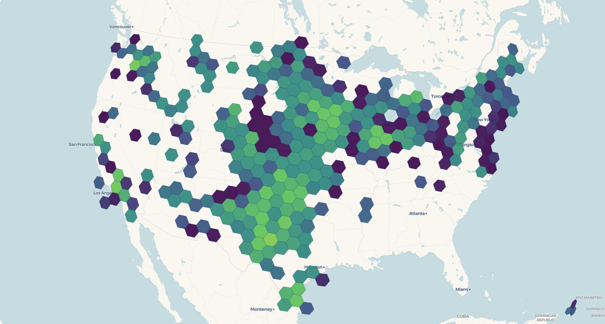
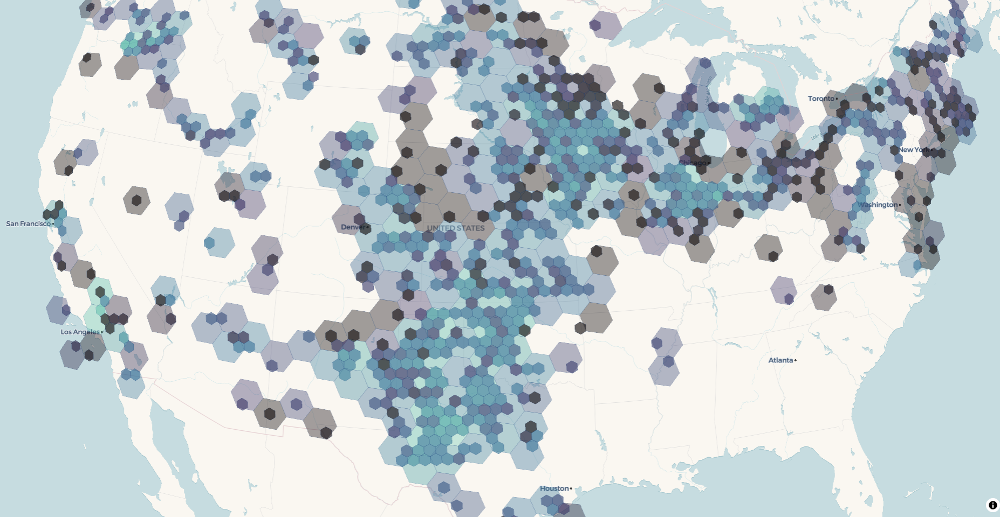
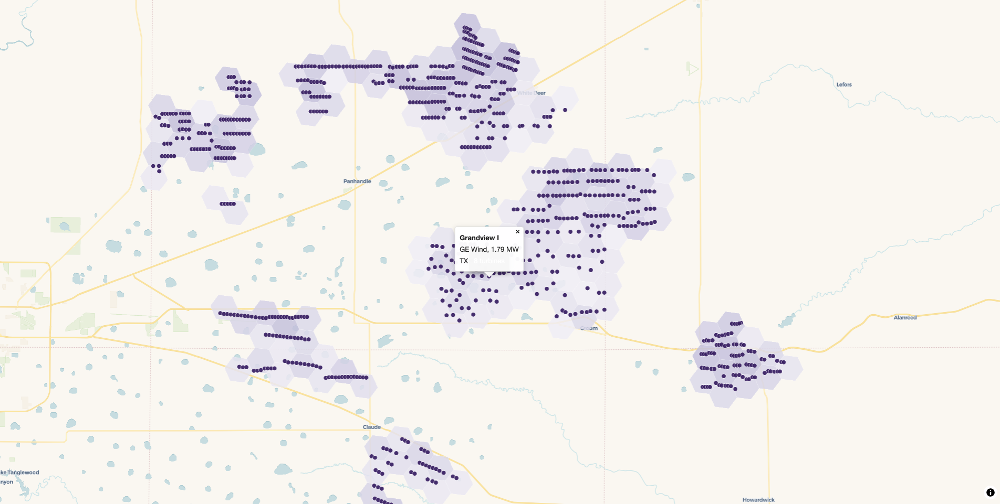

# Dynamic hexagonal binning with H3

When a dataset has tens of thousands of points concentrated in a few
places, neither rendering every individual point nor collapsing them
into a single “200,000+” cluster badge tells you what you want to know.
[`freestile_h3()`](https://walker-data.com/freestiler/reference/freestile_h3.md)
aggregates points into [H3 hexagons](https://h3geo.org/) at
zoom-appropriate resolutions: low zooms show coarse hexagons that
summarize whole regions, intermediate zooms show progressively finer
hexagons, and `base_zoom` and above show the underlying points. You pick
the aggregation rule yourself: a count, a sum, a mean, a max, or
anything else you can write in DuckDB SQL.

The result behaves like point clustering on a map, but with a fixed hex
grid instead of distance-based clusters. It writes a single `.pmtiles`
archive that you can drop on a static host and render with
[view_h3_tiles()](#viewing) or your own
[mapgl](https://walker-data.com/mapgl/) style.

[`freestile_h3()`](https://walker-data.com/freestiler/reference/freestile_h3.md)
is available in both the R and Python packages with the same arguments.
This article uses R for the runnable examples and shows the Python
equivalent where the two APIs differ. For Python installation, see the
[Python Setup](https://walker-data.com/freestiler/articles/python.md)
article.

### Requirements

[`freestile_h3()`](https://walker-data.com/freestiler/reference/freestile_h3.md)
uses DuckDB and its [H3 community
extension](https://duckdb.org/community_extensions/extensions/h3) to do
the binning. On the first call, DuckDB downloads the extension
automatically (`INSTALL h3 FROM community`), so you need network access
that first time.

In R, install the `DBI` and `duckdb` packages (and `mapgl` for viewing):

``` r
install.packages(c("DBI", "duckdb", "mapgl"))
```

In Python, install the `h3` extra, which pulls in the `duckdb` package:

``` bash
pip install 'freestiler[h3]'
```

### Your first hex tileset

Let’s tile the US Wind Turbine Database, the roughly 75,000 turbines the
USGS tracks across the country. The API returns one row per turbine with
a longitude, a latitude, and the turbine’s nameplate capacity in
kilowatts.

``` r
library(freestiler)
library(sf)

url <- "https://energy.usgs.gov/api/uswtdb/v1/turbines?select=t_state,p_name,t_manu,t_cap,xlong,ylat"
turbines <- jsonlite::fromJSON(url)
turbines$capacity_mw <- turbines$t_cap / 1000   # t_cap is in kilowatts

turbines <- st_as_sf(turbines, coords = c("xlong", "ylat"), crs = 4326)

freestile_h3(
  turbines,
  "turbines.pmtiles",
  min_zoom = 2,
  max_zoom = 12,
  base_zoom = 10
)
```

The same call in Python takes a GeoDataFrame:

``` python
import pandas as pd
import geopandas as gpd
from freestiler import freestile_h3

url = "https://energy.usgs.gov/api/uswtdb/v1/turbines?select=t_state,p_name,t_manu,t_cap,xlong,ylat"
turbines = pd.read_json(url)
turbines["capacity_mw"] = turbines["t_cap"] / 1000   # t_cap is in kilowatts

turbines = gpd.GeoDataFrame(
    turbines,
    geometry=gpd.points_from_xy(turbines.xlong, turbines.ylat),
    crs="EPSG:4326",
)

freestile_h3(turbines, "turbines.pmtiles", min_zoom=2, max_zoom=12, base_zoom=10)
```

[`freestile_h3()`](https://walker-data.com/freestiler/reference/freestile_h3.md)
writes one [MVT source-layer per H3 resolution](#layer-naming)
(`h3_r02`, `h3_r03`, and so on) plus a `points` source-layer for the raw
data. With the default `fade = FALSE`, those layers have **disjoint zoom
windows**, so the map swaps hexagon resolutions cleanly as you zoom and
replaces hexagons with individual turbines at `base_zoom`.

### Choosing aggregations

The `agg` argument controls what summary properties each hexagon
carries. The simplest case counts the points in each hex;
`agg = "count"` is the default.

``` r
freestile_h3(turbines, "turbines.pmtiles", agg = "count")
```

For richer summaries, pass a named vector of SQL aggregations:

``` r
freestile_h3(
  turbines, "turbines.pmtiles",
  agg = c(
    n        = "COUNT(*)",
    total_mw = "SUM(capacity_mw)",
    avg_mw   = "AVG(capacity_mw)"
  )
)
```

That gives each hexagon a turbine count (`n`), the total installed
capacity in megawatts (`total_mw`), and the average turbine size
(`avg_mw`), which has climbed steadily as turbine technology has grown.
If you’d rather not write SQL, pass a named list of `c(fn, column)`
pairs instead:

``` r
freestile_h3(
  turbines, "turbines.pmtiles",
  agg = list(
    n        = c("count", "*"),
    total_mw = c("sum",  "capacity_mw"),
    avg_mw   = c("mean", "capacity_mw")
  )
)
```

Supported function names: `count`, `sum`, `mean` (alias `avg`), `min`,
`max`, `median`.

In Python, `agg` is a dictionary. Map names to SQL strings, or to
`(fn, column)` tuples:

``` python
freestile_h3(
    turbines, "turbines.pmtiles",
    agg={"n": "COUNT(*)", "total_mw": "SUM(capacity_mw)"},
)

freestile_h3(
    turbines, "turbines.pmtiles",
    agg={"n": ("count", "*"), "total_mw": ("sum", "capacity_mw")},
)
```

### Viewing

[`view_h3_tiles()`](https://walker-data.com/freestiler/reference/view_h3_tiles.md)
reads the archive metadata, finds the `h3_r*` layers and the points
layer, and builds a `mapgl` map with one shared color scale across the
hex resolutions. It accepts a quick-look default ramp for a first pass;
for a finished map, pass explicit `stops`:

``` r
view_h3_tiles(
  "turbines.pmtiles",
  agg_column = "n",
  stops = list(
    values = c(1, 10, 100, 1000, 10000),
    colors = viridisLite::viridis(5)
  )
)
```



The default scale (`stops = NULL`) spans `1, 10, 100, 1000, 10000` with
the `viridis` palette. That’s fine for a first look, but you’ll usually
want to set `stops` from your own data’s range.

[`view_h3_tiles()`](https://walker-data.com/freestiler/reference/view_h3_tiles.md)
is an R helper. From Python, serve the archive with a static file server
that supports byte-range requests (the built-in `http.server` does not),
then style it in [mapgl](https://walker-data.com/mapgl/) or MapLibre GL
JS. If you work in both languages, the Positron IDE lets you tile in
Python and map in R in the same session.

### DuckDB SQL input

If your points already live in DuckDB, or in a file it can read
(Parquet, CSV, GeoPackage, or Shapefile), skip the in-memory roundtrip
and pass SQL directly. Save the turbine coordinates to a file once, then
let DuckDB build the geometry and the capacity column from its columns:

``` r
write.csv(
  jsonlite::fromJSON(
    "https://energy.usgs.gov/api/uswtdb/v1/turbines?select=xlong,ylat,t_cap"
  ),
  "turbines.csv", row.names = FALSE, na = ""
)

freestile_h3(
  "SELECT ST_Point(xlong, ylat) AS geometry, t_cap / 1000 AS capacity_mw
     FROM read_csv_auto('turbines.csv')",
  "turbines.pmtiles",
  agg = c(n = "COUNT(*)", total_mw = "SUM(capacity_mw)"),
  source_crs = "EPSG:4326"
)
```

The Python call is the same, with a dictionary for `agg`:

``` python
import pandas as pd

pd.read_json(
    "https://energy.usgs.gov/api/uswtdb/v1/turbines?select=xlong,ylat,t_cap"
).to_csv("turbines.csv", index=False)

freestile_h3(
    """SELECT ST_Point(xlong, ylat) AS geometry, t_cap / 1000 AS capacity_mw
         FROM read_csv_auto('turbines.csv')""",
    "turbines.pmtiles",
    agg={"n": "COUNT(*)", "total_mw": "SUM(capacity_mw)"},
    source_crs="EPSG:4326",
)
```

`read_csv_auto()` and `read_parquet()` are built into DuckDB, so they
work the same from R and Python. (Reading remote files over HTTP needs
DuckDB’s `httpfs` and `json` extensions, which the R `duckdb` package
does not always bundle, so download to a local file first.)
Multi-statement SQL works too: setup statements (`CREATE VIEW`, `LOAD`,
and so on) run first, and the final `SELECT` is the input. Here we keep
only the utility-scale turbines over 2 MW:

``` r
freestile_h3(
  paste(
    "CREATE TEMP VIEW big AS",
    "  SELECT * FROM read_csv_auto('turbines.csv') WHERE t_cap > 2000;",
    "SELECT ST_Point(xlong, ylat) AS geometry, t_cap / 1000 AS capacity_mw FROM big"
  ),
  "big_turbines.pmtiles",
  source_crs = "EPSG:4326"
)
```

Pass `source_crs` whenever your SQL returns non-WGS84 geometry. If you
omit it,
[`freestile_h3()`](https://walker-data.com/freestiler/reference/freestile_h3.md)
assumes EPSG:4326 and warns once.

### Cross-fade between resolutions

By default, hexagon resolutions swap cleanly at zoom boundaries. To
blend the transitions instead, so coarser hexes fade out as finer ones
fade in, set `fade = TRUE`:

``` r
freestile_h3(
  turbines, "turbines_fade.pmtiles",
  agg = "count",
  min_zoom = 2, max_zoom = 12, base_zoom = 10,
  fade = TRUE         # default fade_overlap = 1
)
view_h3_tiles("turbines_fade.pmtiles", agg_column = "count", palette = "mako")
```



With `fade = TRUE`, adjacent hex layers overlap by `fade_overlap` zoom
levels.
[`view_h3_tiles()`](https://walker-data.com/freestiler/reference/view_h3_tiles.md)
detects the overlap and gives each layer a trapezoidal `fill_opacity`
envelope so the renderer cross-fades between resolutions. Use a larger
`fade_overlap` (say `2`) for a slower, more diffuse blend, or the
default `1` for a tighter handoff.

### Layer naming

Each MVT source-layer is named `"<hex_layer_prefix>_r<resolution>"`. The
default prefix is `"h3"`, so you’ll see layer ids like `h3_r02`,
`h3_r03`, up through `h3_r07`. The raw-points layer defaults to
`"points"`. You can change either:

``` r
freestile_h3(
  turbines, "turbines.pmtiles",
  hex_layer_prefix = "wind",   # produces "wind_r02", "wind_r03", ...
  point_layer_name = "turbines"
)
```

### Customizing the zoom to H3 resolution mapping

The defaults pair each tile zoom with an H3 resolution whose hexagon
edge length roughly matches a tile pixel at that zoom. Override the
mapping with `h3_resolutions`:

``` r
# res 4 at zoom 0-3, res 6 at zoom 4-6, then points at 7+
freestile_h3(
  turbines, "turbines.pmtiles",
  min_zoom = 0, max_zoom = 10, base_zoom = 7,
  h3_resolutions = c(4, 4, 4, 4, 6, 6, 6)
)
```

The override accepts:

- `NULL` to use the built-in defaults.
- An unnamed integer vector with one entry per hex zoom
  (`length(min_zoom:(base_zoom - 1))`), mapped positionally.
- A sparse named integer vector keyed by zoom number, with defaults
  filling the gaps.

All resolutions must be integers in `0:15`. The same resolution
appearing in non-contiguous zoom runs is rejected, since the layer names
would collide on `h3_rNN`. In Python, `h3_resolutions` takes a list for
the positional form or a dict keyed by zoom for the sparse form.

### Building a production map with mapgl

[`view_h3_tiles()`](https://walker-data.com/freestiler/reference/view_h3_tiles.md)
is a quick preview. For a map you’d actually ship, build it directly
with [mapgl](https://walker-data.com/mapgl/), which gives you full
control over the color scale, the fade envelope, and the tooltips. The
pattern is to read the layer list from the archive metadata, add one
fill layer per H3 resolution, and add a circle layer for the points.

First build a fade archive that carries the columns you want to show:

``` r
freestile_h3(
  turbines, "turbines_fade.pmtiles",
  agg = c(n = "COUNT(*)", total_mw = "SUM(capacity_mw)"),
  min_zoom = 2, max_zoom = 12, base_zoom = 10,
  fade = TRUE
)
```

Then style it. The metadata lists every layer in the archive, so pull
out the hex layers with
[`purrr::keep()`](https://purrr.tidyverse.org/reference/keep.html), sort
them coarse to fine, and fold a fill layer onto the map for each one
with
[`purrr::reduce()`](https://purrr.tidyverse.org/reference/reduce.html).
Every hex layer shares one color scale and gets a zoom-keyed
`fill_opacity` envelope that fades it in and back out across its window,
so overlapping resolutions cross-fade:

``` r
library(mapgl)
library(purrr)
library(stringr)

serve_tiles(".", port = 8080)

meta <- pmtiles_metadata("turbines_fade.pmtiles")

# pull the hex layers out of the metadata, ordered coarse to fine
hex_layers <- meta$metadata$vector_layers |>
  keep(\(layer) str_starts(layer$id, "h3_r")) |>
  map(\(layer) list(id = layer$id, minzoom = layer$minzoom, maxzoom = layer$maxzoom))
hex_layers <- hex_layers[order(map_dbl(hex_layers, "minzoom"))]

points_minzoom <- meta$metadata$vector_layers |>
  keep(\(layer) layer$id == "points") |>
  pluck(1, "minzoom")

# one shared color scale across every resolution
fill <- interpolate(
  column = "n",
  values = c(1, 10, 100, 1000),
  stops  = RColorBrewer::brewer.pal(4, "Purples")
)

base_map <- maplibre(
  bounds = c(meta$min_longitude, meta$min_latitude,
             meta$max_longitude, meta$max_latitude)
) |>
  add_pmtiles_source(id = "turbines", url = "http://localhost:8080/turbines_fade.pmtiles")

# fade each resolution in and back out across its zoom window
add_hex_layer <- function(map, layer) {
  add_fill_layer(
    map,
    id = paste0("fill-", layer$id),
    source = "turbines",
    source_layer = layer$id,
    fill_color = fill,
    fill_opacity = interpolate(
      property = "zoom",
      values = c(layer$minzoom, layer$minzoom + 1, layer$maxzoom, layer$maxzoom + 1),
      stops  = c(0, 0.85, 0.85, 0)
    ),
    fill_outline_color = "rgba(255, 255, 255, 0.25)",
    min_zoom = layer$minzoom,
    max_zoom = layer$maxzoom + 1,            # MapLibre maxzoom is exclusive
    tooltip = "{n} turbines",                # brace template (mapgl >= 0.5.0)
    tooltip_style = tooltip_style("dark")
  )
}

reduce(hex_layers, add_hex_layer, .init = base_map) |>
  add_circle_layer(
    id = "turbine-points",
    source = "turbines",
    source_layer = "points",
    circle_color = "#3b1f6b",
    circle_radius = 4,
    circle_stroke_color = "#ffffff",
    circle_stroke_width = 0.5,
    circle_opacity = 0.9,
    min_zoom = points_minzoom,
    popup = "<strong>{p_name}</strong><br>{t_manu}, {capacity_mw} MW<br>{t_state}",
    popup_style = popup_style("light")
  )
```



Zoom past `base_zoom` and the hexes give way to the individual turbines.
Click one and the `popup` brace template fills a card straight from the
point’s columns: the project name in bold, the manufacturer, the
turbine’s capacity, and the state. `tooltip` works the same way for
hover, and both accept several `{column}` references at once. Wrap a
numeric column in
[`number_format()`](https://walker-data.com/mapgl/reference/number_format.html)
if you want to control how it reads.

### Limitations in this release

- Points only. Polygon and line aggregations (through centroids or
  `h3_polygon_to_cells`) may come in a future release.
- `MULTIPOINT` is not handled. Cast to `POINT` first with
  `sf::st_cast(x, "POINT")` in R, `gdf.explode()` in Python, or
  `ST_Centroid` in SQL.
- [`view_h3_tiles()`](https://walker-data.com/freestiler/reference/view_h3_tiles.md)
  is an R helper. Python users serve the archive and style it in mapgl
  or MapLibre GL JS.
